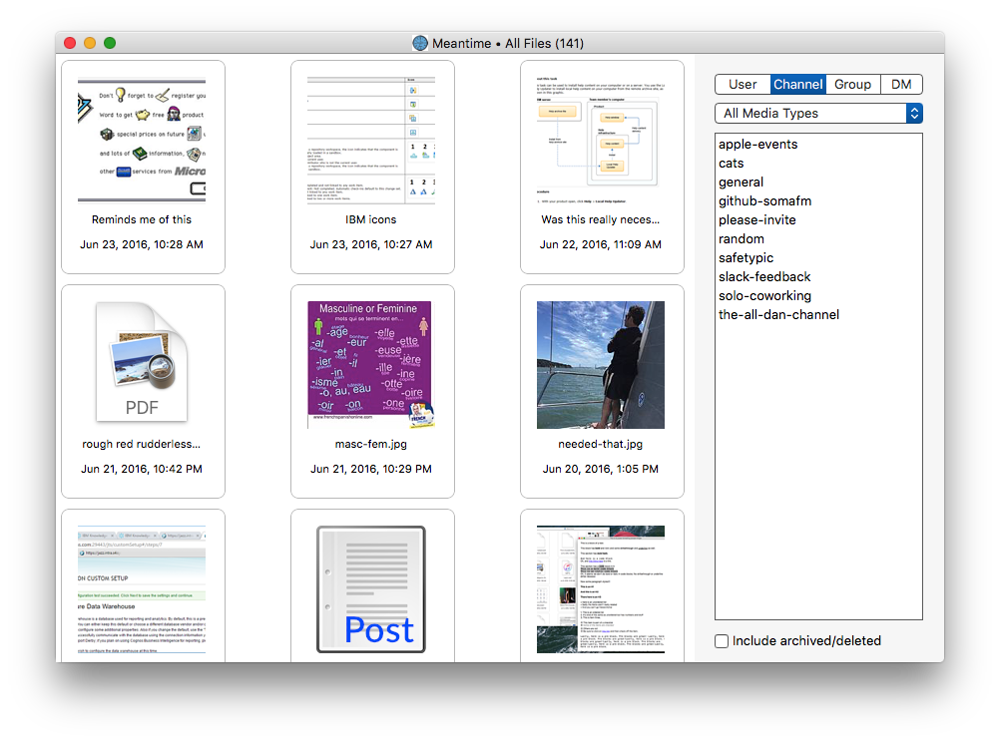

# Slack Files

This app will let you browse all of the files you have access to in your Slack teams. You can filter by location
(channel, group, etc) and by media type (image, video, etc).

Once opened, your files can be saved locally to disk or printed. Audio and video media stream on demand.

After the initial sync (which can take a while for teams with a large numbers of files) all updates happen live.

Requires Mac OS X 10.11 or newer.

